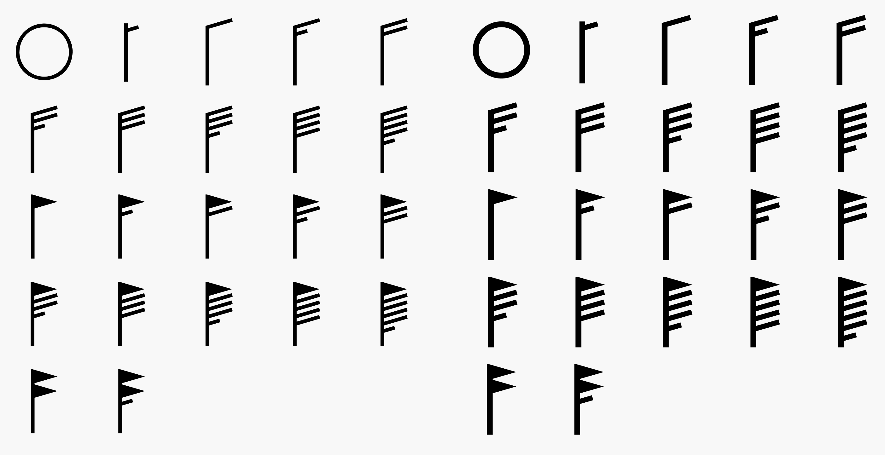

# Windbarbs

Windbarb Glyphs as Regular and Bold fonts.

---

## Basic usage

For now, the old-fashioned way: download the repo and place the `css` and `fonts` directories in your project.

Either add a link to `windbarbs.css` (or the "min" version) in your header, like so:
`<link rel="stylesheet" href="/assets/css/Windbarbs.css"></link>`

or `@import` it in your CSS file:
`@import url("/assets/css/Windbarbs.css");`

(Adjust paths of course as not needed.)

### Invoking a windbarb

`<i className="wb-b wb-r-18-22 wb-rotate-NE"></i>` or
`<i className="wb-b wb-r-18-22 wb-rotate-45"></i>`

For total control of the rotation, use an inline style:
`<i className="wb-b wb-r-18-22" style="transform: rotate(45deg);"></i>`

For Regular use the class `wb` or `wb-r`.
For Bold, use the class `wb-b`

## Roadmap
[ ] Package-manager friendliness
[ ] Javascript utility function for converting a windspeed into the approriate barb class name.
[ ] Clean up the source SVGs and add to the package